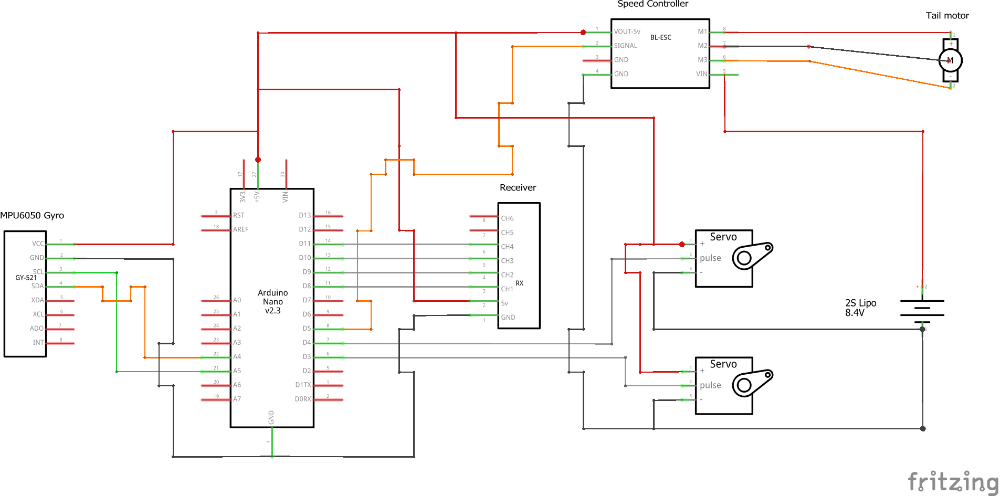

# HeliFlightController
This Arduino sketch is a simple flight controller for a 4ch RC heli based on an [MPU6050 6-axis gyroscope/accelerometer](https://invensense.tdk.com/products/motion-tracking/6-axis/mpu-6050/). 

Stabilization about pitch and roll is accomplished via a PID loop using the Gyro as the proportional term. Stabilization about the yaw axis uses a PI loop along with a counter-torque term that increases as throttle is added. The accelerometer is is not used. Due to this, the program only improves the short-term stability of the helicopter, up to the point that human can stabilize the vehicle in the long-term.  

The program is designed to receive 4 PWM inputs from an RC receiver operating in MODE 2 and outputs 3 PWM signals. Two signals go to the cyclic servos and the third goes to a tail-servo or a speed controller. Since it is assumed only two servo motors are used for controlling the rotor, only a [90-degree swashplate](https://www.rchelicopterfun.com/ccpm.html) is supported. MODE 1 can be used with this program by swapping the RX connections at the arduino. The program was written for an Arduino Nano but it should be compatible with other boards. See the schematic for the required circuit:

 

See these links for flight videos of a helicopter that uses this software:
  
- https://www.youtube.com/watch?v=qZ7qUPAXkvc
- https://www.youtube.com/watch?v=zrrgVdPAhFI

Finally, below are images of the helicopter this code was initially writen for:

   

